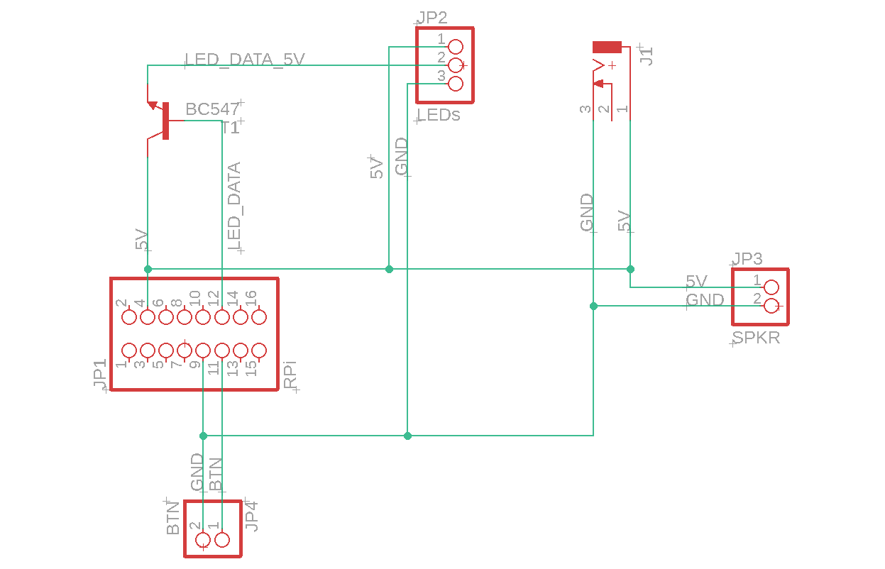

# Apollon - Daily Briefing

## Architektur

Die Anwendung besteht hauptsächlich aus den vier Typen von Klassen, nämlich

* Trigger
* ReportGenerator
* Consumer
* ConsumerHook

Auf die verschiedenen Aufgaben dieser Typen wird in den entsprechenden Kapiteln näher eingegangen.
Diese Aufgaben sind jeweils in einer Basisklasse definiert und eine Spezialisierung überschreibt bei Bedarf die entsprechenden Methoden.
Für jeden Typ gibt es in der ausführbaren Datei eine Liste, in der alle aktiven Spezialisierungen registriert sind.
Die vier Typen bilden damit die untenstehende Pipeline


## Trigger

Trigger werden eingesetzt, um die Pipeline auszulösen. Ihre Basisklasse `TriggerBase` erbt, um die restliche Anwendung nicht zu blockieren, von der Klasse `Thread`. Die Basisklasse implementiert das private Feld `__callback__` sowie die Methode `register_callback(callback: Callable[[None], None])`, mit deren Hilfe eine Kommunikation aus dem Trigger zum Hauptteil der Anwendung möglich ist.  
Ein neuer Trigger kann implementiert werden, indem eine neue Klasse erstellt wird, welche von `TriggerBase` erbt und die Methode `run()` überschreibt. Um den neuen Trigger auszulösen muss lediglich `self.__callback__()` aufgerufen werden. Registriert wird der neue Trigger, indem eine Instanz der Klasse der Liste `triggers` in `main.py` hinzugefügt wird.

### TimeTrigger

Die Spezialisierung `TimeTrigger` muss konfiguriert werden, um verwendet zu werden. Zu diesem Zwecke wird dem Konstruktor ein Tupel aus zwei Ganzzahlen mitgegeben. Dieses Tupel besteht im ersten Eintrag aus der Stunde und im zweiten Eintrag aus der Minute, zu welcher der Trigger auslösen soll. Der TimeTrigger verwendet UTC als Zeitformat.

### ButtonTrigger

Mit dem `ButtonTrigger` kann ein manuelles Briefing durch einen Tastendruck angefordert werden. Als Konstruktorargument wird die Nummer des GPIO Pins erwartet, an den der Taster angeschlossen ist. Der Taster sollte den Pin beim betätigen auf das Ground-Niveau ziehen.

## Report Generators

Nachdem die Pipeline durch einen beliebigen Trigger gestartet wurde, besteht die nächste Station daraus, einen Bericht zu generieren. Die Basisklasse für diesen Typ besteht lediglich aus der Funktion `generate_report() -> string`. Diese Funktion wird in allen spezialisierungen überschrieben und liefert einen Teil des Berichts zurück, welcher am Ende der Pipeline vorgelesen wird.

### CovidReportGenerator

Das Robert Koch Institut stellt eine REST API bereit, mit deren Hilfe die Anzahl von Krankheitsfällen erfragt werden kann, welche am entsprechenden Tag bei den Gesundheitsämtern gemeldet sind. Es handelt sich hierbei nicht um alle Fälle, die im Moment akut sind, sondern um alle, die jemals erfasst wurden. Die Daten beziehen sich außerdem nur auf Deutschland. Gleiches gilt für die Todesfälle. Hierzu ist außerdem hinzuzufügen, dass keine Eindeutige Zuordnung erfolgen kann, die Daten stellen also nur Richtwerte dar.
Die Klasse ruft diese API auf, speichert die Werte zwischen und gibt die aktuellen Fallzahlen und Todesfälle sowie, wenn verfügbar, die Differenz zum letzten Bericht in einem Text zurück.

### WeatherReportGenerator

Ähnlich arbeitet der `WeatherReportGenerator`. Er verwendet die API der OpenWeatherMap um die Vorhersage des aktuellen Tags zu laden. Er informiert den Benutzer in seinem Bericht über die vorraussichtliche Minimal- und Maximaltemperatur, den Niederschlag und den Sonnenuntergang.

## Consumers

Nachdem der Bericht fertiggestellt wurde, werden gilt es, die Informationen zu verbreiten. Diese Aufgabe wird von Klassen übernommen, welche von der `ConsumerBase`-Klasse erben. Auch diese Basisklasse arbeitet als Interface und deklariert die Methode `consume(message: string)`. Auch Consumer arbeiten synchron, um zu verhindern, dass sich Ausgaben überschneiden. Da der `SpeechConsumer` größere Datenmengen über das Netzwerk überträgt, was manchmal zu einem stark asynchronen Einsetzen von Sprache und passender Animation führt, wurde die Methode `prepare_consumption(message: string)` eingeführt. Auf diese Weise kann die Animation erst zu einem späteren Zeitpunkt gestartet werden.

### ConsoleConsumer

Der `ConsoleConsumer` ist vor allem für Entwicklungszwecke interessant. Er schreibt lediglich den generierten Bericht in die Konsole.

### SpeechConsumer

Der `SpeechConsumer` hingegen ist dazu im Stande, den Eingabetext mithilfe eines Clouddienstes in Sprache umzuwandeln. Zur Konfiguration benötigt er den Pfad zu einer Dienstaccountschlüsseldatei. Diese Dateien im JSON-Format enthalten verschiedene Informationen wie ProjektId, Accountemailadresse und ein passender private Key. Die Datei wird von der Google Cloud Platform (GCP) ausgestellt und sollte sich nicht im Projektverzeichnis befinden, um ein versehentliches hinzufügen zur Quellcodeverwaltung zu verhindern. **Bei diesen Dateien handelt es sich um sensible Daten. Mit ihnen können hohe Kosten auf der mit dem Account verknüpften Kreditkarte entstehen. Für den Produktiven Einsatz sollten andere Möglichkeiten für die Authentifizierung bei der Google Cloud Plattform verwendet werden.**

Um die Anmeldung bei der GCP abzuwickeln sowie um die Google Cloud Text to Speech API anzusprechen existiert eine Wrapper Bibliothek, die in diesem Projekt verwendung findet.
Der Google Dienst erzeugt eine Wavesound-Datei, welche über das Modul `PyGame` wiedergegeben wird.

## ApplicationHooks

Zu bestimmten Ereignissen, wie dem erfolgreichen Start der Anwendung oder dem Beginn der Consumerphase in der Pipeline werden mithilfe der ApplicationHooks bestimmte Hooks ausgeführt. Klassen können hierfür von der `ApplicationHookBase`-Klasse erben und die relevanten Methoden implementieren um Code an den entsprechenden Zeitpunkten auszuführen.

### LED Hook

Die Lichteffekte der Zähne und der Augen werden über ApplicationHooks realisiert. Dies ist notwendig, da die verwendeten LEDs ein Signal benötigen um ihr Standartbild darzustellen. Außerdem soll die Animation über die gesamte Dauer der Sprache abgespielt werden, weshalb eine Spezialisierung der ConsumerBase-Klasse nicht verwendbar ist. Zum Einsatz kommen 20 WS2812B RGB LEDs, die über eine Bibliothek von Adafruit gesteuert werden können. Mit dieser Bibliothek kann ein Objekt instanziiert werden, auf das wie auf eine Liste zugegriffen werden kann. Wird der Wert eines Elements auf ein Dreiertupel aus ganzzahlen gesetzt, nimmt die entsprechende LED die Farbe an, die dem RGB Code entspricht. Die Konfiguration dieser Klasse gestaltet sich am Komplexesten und wird über das unten abgebildete Dictionary implementiert.

```python
{
    "LED_COUNT": 20,
    "THEME": [(0, 0, 0), (0, 0, 255), (0, 162, 20), (255, 0, 0)],
    "ANIMATIONS": {
        "SPEECH": [
            [1, 2, 2, 2, 1, 2, 1, 2, 1, 2, 1, 2, 2, 2, 1, 2, 2, 2, 3, 3],
            [2, 2, 2, 1, 2, 2, 2, 1, 2, 1, 2, 1, 2, 1, 2, 2, 2, 1, 3, 3],
            [2, 2, 1, 2, 2, 2, 1, 2, 1, 2, 1, 2, 1, 2, 2, 2, 1, 2, 3, 3],
            [2, 1, 2, 2, 2, 1, 2, 1, 2, 1, 2, 1, 2, 2, 2, 1, 2, 2, 3, 3]
        ],
        "DEFAULT": [[2, 2, 2, 2, 2, 2, 1, 1, 1, 1, 1, 1, 2, 2, 2, 2, 2, 2, 0, 0]],
        "GENERATING":[
            [2 ,2 ,2 ,2 ,2 ,2 ,0 ,0 ,0 ,0 ,0 ,1 ,2 ,2 ,2 ,2 ,2 ,2, 2],
            [2 ,2 ,2 ,2 ,2 ,2 ,0 ,0 ,0 ,0 ,1 ,0 ,2 ,2 ,2 ,2 ,2 ,2, 2],
            [2 ,2 ,2 ,2 ,2 ,2 ,0 ,0 ,0 ,1 ,0 ,0 ,2 ,2 ,2 ,2 ,2 ,2, 2],
            [2 ,2 ,2 ,2 ,2 ,2 ,0 ,0 ,1 ,0 ,0 ,0 ,2 ,2 ,2 ,2 ,2 ,2, 2],
            [2 ,2 ,2 ,2 ,2 ,2 ,0 ,1 ,0 ,0 ,0 ,0 ,2 ,2 ,2 ,2 ,2 ,2, 2],
            [2 ,2 ,2 ,2 ,2 ,2 ,1 ,0 ,0 ,0 ,0 ,0 ,2 ,2 ,2 ,2 ,2 ,2, 2]
        ]
    }
}
```

Wie zu sehen ist, muss für den Fall, dass eine andere LED-Leiste mit einer höheren LED Dichte verwendet wird die Anzahl der Pixel angegeben werden. Unter dem Schlüssel `THEME` können RGB Farben als Dreiertupel angegeben werden, deren Index mit deren Index die Farben später verwendet werden können. Unter `ANIMATIONS` können die Animationen angegeben werden, die bei bestimmten Ereignissen abgespielt werden. Es existieren die Schlüssel

* `GENERATING` - Während die Consumer sich auf den neuen Bericht einstellen
* `SPEECH` - Während die Consumer die Methode `` bearbeiten
* `DEFAULT` - Zu allen verbleibenden Zeitpunkten

Die Animationen werden als zweidimensionale Liste von ganzzahlen gespeichert. Die erste Dimension steht für den Frame, die zweite für die Position des Pixels in der Leiste. Die Zahl repräsentiert eine Farbe, wie sie in der `Theme` Eigenschaft angegeben wurde.

## Elektronik

Herzstück des Projekts ist ein Raspberry Pi Zero W. Das Gehäuse beinhaltet außerdem eine einfache Platine zur Stromverteilung und Pegelwandlung, die dem unten stehendem Plan folgt. Die Platine wurde als Shield für den Raspberry Pi in Eagle konzipiert und anschließend geätzt.

Die Buchse `J1` nimmt einen Holstecker auf und gibt die anliegende Spannung von 5V an die Platine weiter. Diese versorgt damit den Raspberry Pi über die GPIO Pins, die LEDs und den verbauten Lautsprecher. Beim Versorgen des Raspberry Pi mit Strom über die GPIO Pins ist Vorsicht geboten, denn dadurch wird die in vielen Raspberry Pis verbaute Sicherung umgangen. Im speziellen Fall mit einem Raspberry Pi Zero ist das jedoch kein Thema, da hier ohnehin auch bei der USB-Buchse keine Sicherung verbaut ist. Eine weitere Aufgabe der Platine ist es außerdem, die GPIO Pins für den Taster nach außen zu führen. wichtigste Aufgabe ist es jedoch, mithilfe des Transistors `T1` die 3,3V Spannung, die der Raspberry Pi schält auf die 5V Spannung, welche die LEDs auch im Datensignal benötigen, zu wandeln.
